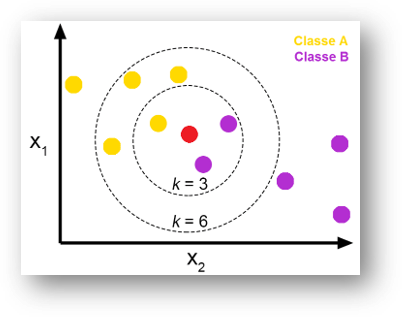
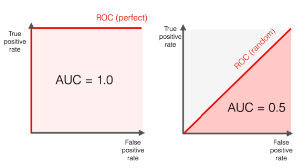

```{r klippy, echo=FALSE, include=TRUE}
#install.packages("remotes")
#remotes::install_github("rlesur/klippy", force = TRUE)
library(klippy)
klippy::klippy(
  lang = c("r", "markdown"),
  all_precode = FALSE,
  position = c("top", "right"),
  color = "auto",
  tooltip_message = "Copy code",
  tooltip_success = "Copied!"
)
```


# Algoritmo de Classificação - KNN
## Introdução
Nesta aula veremos alguns algoritmos de classificação, começando com o `K-Nearest Neighbors (KNN)`, que é um algoritmo de aprendizado supervisionado. O KNN é um algoritmo simples que armazena todos os casos disponíveis e classifica novos casos com base em uma medida de similaridade (por exemplo, distância Euclidiana). O KNN tem sido usado em estatística e reconhecimento de padrões por muitos anos.  

As técnicas de classificação são utilizadas para a identificação do rótulo de determinadas observações com base em características e informações previamente conhecidas (Lantz 2013).  A classificação é uma técnica de aprendizado supervisionado, onde o objetivo é identificar a qual classe pertence uma determinada observação.  

A capacidade do modelo de gerar uma predição satisfatória é denominada capacidade de generalização, ou seja, quão bom o modelo é na predição de classe ou valor dos novos registros ainda não rotulados.  

Neste tutorial exploramento os algoritmos `K vizinhos mais próximos (K Nearest Neighbor - KNN)`, `Naïve Bayes` e `Árvore de Decisão`.  
  
### Objetivos
1. Apresentar o algoritmo KNN;
2. Apresentar o algoritmo Naïve Bayes;
3. Apresentar o algoritmo Árvore de Decisão.

### Pré-requisitos

Para acompanhar este tutorial é necessário ter conhecimento básico de R e de estatística descritiva.  

## Algortimo KNN

O algoritmo KNN é um dos algoritmos mais simples de classificação e é baseado na ideia de que os objetos semelhantes tendem a estar próximos uns dos outros. O algoritmo KNN é um tipo de aprendizado supervisionado, onde o resultado é classificado por maioria de votos dos vizinhos mais próximos.   

O algoritmo K-Nearest Neighbors (KNN) é um dos métodos clássicos de classificação, conhecido por sua simplicidade e eficiência. Ele é amplamente utilizado para classificar objetos com base em exemplos de treinamento que estão mais próximos no espaço de características, ou seja, ele toma como base a proximidade entre pontos de dados para inferir a classe de novos exemplos.  

Para seu funcionamento, o KNN necessita inicialmente de uma métrica de distância que permita calcular o quão próximos dois exemplos estão um do outro. A métrica mais comum utilizada é a `distância Euclidiana`, mas outras métricas, como a `distância de Manhattan` ou `de Minkowski`, também podem ser aplicadas, dependendo da natureza dos dados.  

Outro passo importante no uso do KNN é a definição do valor de `K`, que indica quantos vizinhos mais próximos serão considerados pelo algoritmo na classificação. A escolha de K é crucial, pois um valor muito pequeno pode tornar o modelo sensível a ruídos, enquanto um valor muito grande pode diluir a influência dos vizinhos mais relevantes.  

Finalmente, a classificação de um exemplo desconhecido é feita por meio de uma votação majoritária entre os K vizinhos mais próximos. Ou seja, o rótulo de classe que for mais frequente entre os vizinhos próximos será atribuído ao exemplo a ser classificado. Este processo simples e intuitivo faz do KNN uma escolha comum em problemas de classificação, especialmente quando a interpretação da decisão é importante.  

```{r}
# Setar diretório de Trabalho
setwd("C:/Users/fhaes/Documents/GitHub/Agroenegia/Classific")
```



  
A imagem acima ilustra o funcionamento do algoritmo KNN. Neste exemplo, temos um conjunto de dados com duas classes distintas (amarelo e roxo) e um novo exemplo a ser classificado (ponto vermelho). O algoritmo KNN calcula a distância entre o novo exemplo e os exemplos de treinamento, selecionando os K vizinhos mais próximos. Neste caso, K = 3, então os três vizinhos mais próximos são selecionados (dois da classe roxo e um da classe amarelo). Como a maioria dos vizinhos é da classe roxo, o novo exemplo é classificado como roxo. Para o  K = 6, o novo exemplo seria classificado como amarelo, pois são quatro amarelos e dois roxos.  

### Vantagens e Desvantagens do KNN

#### Vantagens
1. **Simplicidade**: O KNN é um algoritmo simples e fácil de entender, o que o torna uma boa escolha para problemas de classificação.
2. **Não paramétrico**: O KNN não faz suposições sobre a distribuição dos dados, o que o torna útil para dados não lineares e complexos.
3. **Interpretabilidade**: A classificação do KNN é baseada na proximidade dos exemplos, o que torna fácil interpretar as decisões do modelo.
4. **Robustez**: O KNN é robusto a outliers e ruídos nos dados, pois considera vários vizinhos próximos em vez de depender de um único exemplo.

#### Desvantagens
1. **Sensibilidade à escala**: O KNN é sensível à escala dos dados, o que pode levar a resultados distorcidos se as variáveis tiverem escalas diferentes.
2. **Custo computacional**: O KNN precisa calcular a distância entre o novo exemplo e todos os exemplos de treinamento, o que pode ser computacionalmente caro para grandes conjuntos de dados.
3. **Escolha de K**: A escolha do valor de K é crucial para o desempenho do modelo, e um valor inadequado pode levar a resultados subótimos.


### Exemplo de Aplicação do KNN

Primeiro vamos carregar os pacotes que iremos utlizar:

#### Pacotes

Para isso vamos carregar os seguintes pacotes:  
```{r, message=FALSE, warning=FALSE}
if(!require(tidyverse)) install.packages("tidyverse")
if(!require(skimr)) install.packages("skimr")
if(!require(caret)) install.packages("caret")
if(!require(philentropy)) install.packages("philentropy")
if(!require(readxl)) install.packages("readxl")
if(!require(class)) install.packages("class")
if(!require(gt)) install.packages("gt")

library(tidyverse)
library(skimr)
library(caret)
library(philentropy)
library(readxl)
library(class)
library(gt)
```


```{r}
dados <- tibble(
  a1 = c(0,10,2,6,4,1,8,10,6),
  a2 = c(250,150,90,78,20,170,160,180, 200),
  a3 = c(36,34,10,8,1,70,41,38,45))

classe <- factor(c(rep(c("A", "B"), 4), NA))
dados <- cbind(dados, classe)
```

Vamos visualizar os dados:  
```{r echo=FALSE}
dados |> 
      gt()
```

#### Padronizar os dados

A padronização dos dados é uma etapa importante para garantir que todas as variáveis tenham a mesma escala e não influenciem indevidamente o algoritmo.  

O cálculo do valor padronizado é feito subtraindo a média da variável e dividindo pelo desvio padrão:  
$$x^* = \frac{x_i - \bar x}{s} $$
Onde o $x^*$ é o valor padronizado, $x_i$ é o valor original, $\bar x$ é a média da variável e $s$ é o desvio padrão.  
Para isso, vamos padronizar os dados utilizando a função `scale()` do R.

```{r}
# Padronizando
df <- scale(dados[,1:3], 
            center = T)
```

Vamos visualizar os dados padronizados:  
```{r echo=FALSE}
df |> 
  as_tibble() |> 
  gt()
```


### Calculando a distância entre dois pontos.  
Existem várias formas diferentes de calcular essa distância. A mais simples é a distância euclidiana. É a distância entre pontos, que pode ser provada pela aplicação repetida do teorema de Pitágoras.  

A distância euclidiana entre dois pontos, `p` e `q`, em um espaço n-dimensional é calculada da seguinte forma:  

$$d(p, q) = \sqrt{(p_1 - q_1)^2 + (p_2 - q_2)^2 + \ldots + (p_n - q_n)^2}$$

Onde:
- $p_1, p_2, \ldots, p_n$ são as coordenadas do ponto `p`;
- $q_1, q_2, \ldots, q_n$ são as coordenadas do ponto `q`;
- $n$ é o número de dimensões do espaço.


Essencialmente, a distância Euclidiana é a raiz quadrada da soma dos quadrados das diferenças entre as coordenadas correspondentes de 𝑝 e 𝑞.

Vamos calcular a distância entre os pontos:  
```{r, warning=FALSE, message=FALSE}
distancias <- philentropy::distance(x = df,
                              method = "euclidean") |> 
  round(digits = 3)
print(distancias)
```

Observe que o resultado é uma matriz de distâncias entre os pontos. Cada elemento da matriz representa a distância entre os pontos correspondentes nas linhas e colunas. Para o nosso exemplo em estudo, o elemento na linha 9 é o que desejamos verificar as distâncias. 

Desta forma, a distância entre o ponto 9 e os demais pontos é observada na última linha da matriz. Sendo a distância do ponto 9 para o ponto 1 de `r distancias[9,1]`, para o ponto 2 de `r distancias[9,2]`, para o ponto 3 de `r distancias[9,3]`, para o ponto 4 de `r distancias[9,4]`, para o ponto 5 de `r distancias[9,5]`, para o ponto 6 de `r distancias[9,6]`, para o ponto 7 de `r distancias[9,7]` e para o ponto 8 de `r distancias[9,8]`.  

Outra função que pode ser utilizada para calcular a distância entre os pontos é a função `dist()` do pacote {stats} R.  

```{r}
dist2 <- dist(df, method = "euclidean") |> 
  round(digits = 3)
print(dist2)
```

O resultado é a distância entre os pontos, de forma semelhante a função `philentropy::distance()`.

### Classificação do ponto 9

Vamos classificar o ponto 9 utilizando a lógica por trás do algoritmo KNN. Para isso, vamos considerar inicialmente os 3 vizinhos mais próximos (`k = 3`).  E por votação majoritária atribui-se à amostra desconhecida a classe mais frequente entre os K vizinhos. Cada vizinho vota com a sua classe, e a classe com mais votos é atribuída ao novo ponto. Por isso a importância de escolher um valor de K ímpar.  

Voltando a nossa base de dados originais.  

```{r}
dados
```

Vamos analisar as distâncias do ponto 9 para os demais pontos em ordem crescente.
```{r}
d9 <- distancias[9,] |> 
  sort()
print(d9)
```

Agora vamos considerar os 3 vizinhos mais próximos para o ponto 9. Que são os pontos 7 (distância de `r distancias[9,7]`), 8 (distância de `r distancias[9,8]`) e 2 (distância de `r distancias[9,2]`). Agora obervando a classe desses pontos, temos que a classe do ponto 7 é $A$, do ponto 8 é $B$ e do ponto 2 é $B$, sendo a classe mais frequente a classe `B`. Portando, o ponto 9 é classificado como $B$.  
 
Se quisermos classificar o ponto 9 para um valor de $K = 5$, temos que os pontos mais próximos são os pontos 7, 8, 2, 1 e 6. E a classe mais frequente é a classe $B$. Portanto, o ponto 9 é classificado como $B$ também para k = 5.  

Para $k = 7$, temos que os pontos mais próximos são os pontos 7, 8, 2, 1, 6, 4 e 3. E a classe mais frequente é a classe $B$. Portanto, o ponto 9 é classificado como $B$ para k = 7.


### Implementação do KNN

Para isso, vamos utilizar a função `knn()` do pacote {class} R.  

Como é um exemplo simples, não dividimos em treino e teste, no entanto o equivalente a nossos conjunto de dados teste são os oito primeiros pontos e o ponto 9 é o ponto a ser classificado.  

```{r}
treino <- df[1:8,]
classe <- dados[1:8,4]
prever <- df[9,1:3] # Elemento da linha 9
```

Agora vamos classificar o ponto 9 para $k = 3$ utilizando a função `knn()` do pacote {class} R.  

```{r}
previsão <- knn(treino, 
                prever, 
                cl = classe, 
                k = 3)
print(previsão)
```

Observamos que a previsão para o ponto 9 é a classe $B$.

Mudando o valor do hiperparâmetro $k$ para 5 e 7, temos:  

```{r}
previsão <- knn(treino, 
                prever, 
                cl = classe, 
                k = 5)
print(previsão)
```

A classificação do ponto 9 para $k = 5$ é a classe $B$. E para $k = 7$ temos:  

```{r}
previsão <- knn(treino, 
                prever, 
                cl = classe, 
                k = 7)
print(previsão)
```

Para os três valores de $k$ testados, a classificação do ponto 9 foi a classe $B$. Podemos concluir que o ponto 9 foi classificado como $B$ para os valores de $k = 3$, $k = 5$ e $k = 7$, sendo razoável aceitas esta classificação.  


### Exemplo 2 de Aplicação do KNN
Vejamos outro exemplo de aplicação do KNN.  

O exemplo a seguir é um exemplo de classificação de sementes de soja.  

```{r}
# Vamos limpar a memória
rm(list = ls())
```

Carregando os dados
```{r}
# Classes de sementes de soja
df <- read_excel("exemplo_semente.xlsx")
glimpse(df)
```

```{r}
# Transformar a classe em fator na sequêcia: Alta, Média e Baixa. 
df$Classe <- factor(df$Classe, 
                    levels = c("alta", "media", "baixa"))
print(df$Classe)
```


Vamos visualizar os dados:  
```{r}
plot(df[,1:5])
```

A função skimr::skim() é uma função que fornece um resumo estatístico dos dados.  
```{r}
# Verificação de escala.
skimr::skim(df)
```

Podendo ser realizada por categoria.
```{r}
# Resumo por Classe
df |> 
      group_by(Classe) |>
      skim()
```


Outra forma de visualizar os dados é através de uma tabela de frequência.  
```{r}
casses_verdadeiras <- xtabs(~Classe, data = df)
print(casses_verdadeiras)
```

Vamos padronizar os dados.  
```{r}
# Padronizando
df_p <- data.frame(scale(df[,1:5]), 
                   as.factor(df$Classe)) |> 
  rename(Classe = as.factor.df.Classe.)
print(summary(df_p))
```

Observe que os valores foram padronizados, para média igual a zero e desvio padrão igual a 1.  
A padronização dos dados é uma etapa fundamental em diversos processos de análise estatística, aprendizado de máquina e modelagem preditiva. Ela envolve transformar variáveis para que tenham uma escala comum, o que pode ser feito subtraindo a média e dividindo pelo desvio padrão, ou reescalando os valores para uma faixa específica, como [0, 1]. A padronização é particularmente importante em algoritmos que dependem de medições de distância ou variáveis com diferentes escalas.  
Algoritmos que dependem de medições de distância, como KNN (K-vizinhos mais próximos) e clustering (K-means, por exemplo), podem ser severamente influenciados por variáveis com escalas maiores. Nesse caso, variáveis com valores numéricos maiores podem influenciar fortemente as distâncias calculadas, distorcendo os resultados. Padronizar os dados assegura que todas as variáveis tenham um impacto comparável nas medidas de distância.  

Agora vamos dividir os dados em treino e teste.  

```{r}
# Separando em treino e test.
n <- nrow(df_p)
set.seed(134) # Para reprodutibilidade dos resultados.
i <- sample(x = c(TRUE, FALSE),
            size = n,
            replace = TRUE,
            prob = c(0.70, 1 - 0.70))

df_train <- df_p[i, ]
print(nrow(df_train))
df_test <- df_p[!i, ]
print(nrow(df_test))
```

Vamos verificar a proporção de treino e teste.  
```{r}
# Proporção treino e teste
prop <- round(c(nrow(df_train), 
        nrow(df_test))/n, 
      digits = 3)*100
print(prop)
```

Muito próximo de 70% para treino e 30% para teste.  

#### Obtendo as predições para o conjunto de teste via conjunto de treino.
- K = 3
```{r}
m0 <- knn(train = df_train[, -6],
          test = df_test[, -6],
          cl = df_train[, 6],
          k = 3)
```

#### Avaliação do modelo
```{r}
# Tabela de confusão.
ct <- table(df_test[, 6], m0)
# Renomeando as linhas e colunas
rownames(ct) <- c("Alta_V", "Média_V", "Baixa_V")
colnames(ct) <- c("Alta_Prev", "Média_Prev", "Baixa_Prev")
print(ct)
```


```{r}
# Conferindo a Tabela do teste
print(xtabs(~Classe, data = df_test))
```

Visualizando os erros e acertos.  
```{r}
# Juntando a base de teste com a previsão
df_comp <- cbind(df_test, Previssao = m0)
df_comp |> 
  gt()
```


#### Acurácia do modelo.  
```{r}
# Acurária = Fração de acertos totais.
A <- sum(diag(ct))/sum(ct)*100
print(paste0(round(A, 1), "%"))
```

O modelo obteve uma acurácia de `r paste0(round(A, 1), "%")`, ou seja, acertou `r sum(diag(ct))` de `r sum(ct)` observações da base de teste.  


#### Precisão, Sensibilidade e F1-Score
Precisão, Sensibilidade e F1-Score são úteis para cada classe individualmente.


##### Precisão = Valor preditivo 
A Precisão é uma métrica que indica a proporção de previsões corretas para uma determinada classe em relação ao total de previsões feitas para essa classe. Ou seja, a Precisão foca em quantas das previsões feitas para uma classe específica realmente pertencem àquela classe. A fórmula para calcular a Precisão é:  

$$P = \frac{TP}{TP + FP}$$
No exemplo em questão temos:  
* Precisão para a Classe "Alta":  
Para calcular a precisão da classe "alta", olhamos para o número de Verdadeiros Positivos e Falsos Positivos:  

*Verdadeiros Positivos (VP)*: São as previsões corretas para a classe "Alta". Aqui, temos `r ct[1,1]` sementes corretamente classificadas como "Alta".  
*Falsos Positivos (FP)*: São as sementes previstas como "Alta", mas que na verdade pertencem a outra classe. Nesse caso, temos `r ct[2,1]` sementes da classe "Alta" classificadas como da classe "Média" e `r ct[3,1]` sementes da classe "Alta" classificadas como "Baixa".  
Agora podemos calcular a precisão para a classe "Alta":
$$P_i = \frac{TP_i}{TP_i + FP_i}$$  
$$P = \frac{`r ct[1,1]`}{`r ct[1,1]` + `r ct[2,1]` + `r ct[3,1]`}$$  
$$P = \frac{`r ct[1,1]`}{`r sum(ct[,1])`}$$  
$$P = `r ct[1,1]/sum(ct[,1])`$$  
Multiplicando por 100 para obter a porcentagem.  
$$P = `r ct[1,1]/sum(ct[,1])*100`$$  


```{r}
P_alta <- ct[1,1]/sum(ct[,1])
print(paste0(round(P_alta,3)*100, "%"))
```

- De forma análoga fazemos para as demais classes.  
```{r}
P_media <- ct[2,2]/sum(ct[,2])
print(paste0(round(P_media,3)*100, "%"))
```

```{r}
P_baixa <- ct[3,3]/sum(ct[,3])
print(paste0(round(P_baixa,3)*100, "%"))
```


#####  Sensibilidade/Recall

A Sensibilidade (também chamada de Recall ou Taxa de Verdadeiros Positivos) é uma métrica de avaliação de modelos de classificação que indica a capacidade do modelo em identificar corretamente as instâncias de uma classe específica. Em outras palavras, ela nos diz o quão bem o modelo consegue capturar todos os exemplos de uma classe.

A fórmula para a Sensibilidade para uma classe $C_i$ é dada por:
$$Sensibilidade_{C_i} = \frac{TP_i}{TP_i + FN_i} $$
Onde:
- $TP_i$ é o número de verdadeiros positivos para a classe $C_i$;
- $FN_i$ é o número de falsos negativos para a classe $C_i$, ou seja, quando o modelo classifica erradamente exemplos da classe $C_i$ como sendo de outra classe.  
No exemplo em questão temos:  

* Para a classe "Alta":  
$$Sensibilidade_{Alta} = \frac{TP_{Alta}}{TP_{Alta} + FN_{Alta}}$$  
$$Sensibilidade_{Alta} = \frac{`r ct[1,1]`}{`r ct[1,1]` + (`r ct[1,2]` + `r ct[1,3]`)} $$  
$$Sensibilidade_{Alta} = \frac{`r ct[1,1]`}{`r ct[1,1]` + `r ct[1,2] + ct[1,3]`}$$  
$$Sensibilidade_{Alta} = \frac{`r ct[1,1]`}{`r sum(ct[1,])`}$$  
$$Sensibilidade_{Alta} = `r ct[1,1]/sum(ct[1,])`$$  
Multiplicando por 100 para obter a porcentagem.  
$$Sensibilidade_{Alta} = `r ct[1,1]/sum(ct[1,])*100`$$  

No R temos para a classe "Alta":   
```{r}
S_alta <- ct[1,1]/sum(ct[1,])
print(paste0(round(S_alta,3)*100, "%"))
```

Para a classe "Média":  
```{r}
S_media <- ct[2,2]/sum(ct[2,])
print(paste0(round(S_media,3)*100, "%"))
```

Para a classe "Baixa":  
```{r}
S_baixa <- ct[3,3]/sum(ct[3,])
print(paste0(round(S_baixa,3)*100, "%"))
```

A Sensibilidade é uma métrica importante quando queremos minimizar o número de falsos negativos, ou seja, quando é crucial que o modelo identifique o máximo possível de exemplos de uma determinada classe. Isso é especialmente importante em situações onde falhas na detecção podem ser custosas, como em diagnósticos médicos ou controle de qualidade no agronegócio.  
No exemplo de diagnósticos de qualidade no agronegócio, vamos imaginar a seguinte situação: um modelo de classificação é utilizado para identificar doenças em plantas, se o modelo tiver uma baixa Sensibilidade, ele pode deixar de detectar plantas doentes, o que pode levar a uma propagação da doença e prejuízos para o produtor. Portanto, a Sensibilidade é uma métrica importante para avaliar a capacidade do modelo em identificar corretamente os casos positivos de doenças.    

##### F1-Score = Média harmônica entre precisão e Sensibilidade 

O `F1-Score` é uma métrica que combina a `Precisão` e a `Sensibilidade (Recall)` em uma única métrica, oferecendo um equilíbrio entre elas. É especialmente útil quando existe um desequilíbrio entre as classes, pois considera tanto os falsos positivos quanto os falsos negativos. O F1-Score é a média harmônica entre a Precisão e a Sensibilidade, garantindo que ambos os aspectos sejam igualmente ponderados.  

Fórmula do F1-Score:  
$$F1 = 2 \times \frac{Precisão \times Sensibilidade}{Precisão + Sensibilidade}$$

No exemplo em questão temos:
* Para a classe "Alta":  

$$F1_{Alta} = 2 \times \frac{Precisão_{Alta} \times Sensibilidade_{Alta}}{Precisão_{Alta} + Sensibilidade_{Alta}}$$

No R temos:  
```{r}
F1_alta <- 2*((P_alta*S_alta)/(P_alta+S_alta))
print(paste0(round(F1_alta,3)*100, "%"))
```

Para as demais classes temos:  
```{r}
F1_media <- 2*((P_media*S_media)/(P_media+S_media))
print(paste0(round(F1_media,3)*100, "%"))
```

```{r}
F1_baixa <- 2*((P_baixa*S_baixa)/(P_baixa+S_baixa))
print(paste0(round(F1_baixa,3)*100, "%"))
```


#### Especificidade.

A Especificidade (também chamada de Taxa de Verdadeiros Negativos, ou True Negative Rate) é uma métrica que avalia a proporção de negativos verdadeiros corretamente identificados pelo modelo em relação ao total de exemplos que realmente são negativos. Em outras palavras, a Especificidade mede a capacidade do modelo de não classificar falsamente os negativos como positivos.

Fórmula da Especificidade:
$$Especificidade = \frac{TN}{TN + FP}$$  
Onde:
- $TN$ é o número de verdadeiros negativos;
- $FP$ é o número de falsos positivos.

No exemplo em questão temos:
* Para a classe "Alta":
- $TN$ é o número de verdadeiros negativos para a classe "Alta". Aqui, temos `r sum(c(ct[2,2], ct[3,3]))` sementes corretamente classificadas como "Média" e "Baixa", que são as sementes que realmente não têm qualidade "Alta" e foram corretamente classificadas como não sendo "Alta".  
- $FP$ é o número de falsos positivos para a classe "Alta". Aqui, temos `r ct[2,1]` e `r ct[3,1]` sementes "Média" e "Baixa" incorretamente previstas como "Alta".  

$$Especificidade_{Alta} = \frac{TN_{Alta}}{TN_{Alta} + FP_{Alta}}$$  


No R temos:  
```{r}
E_alta <- sum(c(ct[2,2], ct[3,3]))/(sum(c(ct[2,2], ct[3,3]))+sum(ct[2:3,1]))
print(paste0(round(E_alta,3)*100, "%"))
```

Para as demais classes temos:  

```{r}
E_media <- sum(c(ct[1,1],ct[3,3]))/(sum(c(ct[1,1],ct[3,3]))+sum(ct[c(1,3),2]))
print(paste0(round(E_media,3)*100, "%"))
```

```{r}
E_baixa <- sum(c(ct[1,1],ct[2,2]))/(sum(c(ct[1,1],ct[2,2]))+sum(ct[1:2,3]))
print(paste0(round(E_baixa,3)*100, "%"))
```

#### Curva ROC

A curva ROC (Receiver Operating Characteristic) é uma ferramenta gráfica que nos ajuda a avaliar a capacidade de um modelo de classificação binária em distinguir entre duas classes. A curva ROC é construída plotando a Taxa de Verdadeiros Positivos (Sensibilidade) no eixo y e a Taxa de Falsos Positivos (1 - Especificidade) no eixo x.  

Um valor de ROC de 0,5 indica um desempenho aleatório, enquanto um valor de 1 indica um desempenho perfeito, como podemos ver nas imagens abaixo.  

  
Desta forma, quanto maior a ROC, melhor o modelo está em separar as classes.  

Para calcular a Curva ROC em um problema de classificação com três categorias ("Alta", "Média" e "Baixa"), é necessário transformar o problema de múltiplas classes em um problema binário para cada uma das classes. Isso é feito através da abordagem One-vs-Rest (Um contra Todos). Para cada classe, você calcula uma curva ROC considerando aquela classe como a positiva, e as demais como negativas.  

Para cada classe, criamos um classificador binário, calculando a matriz de confusão para cada classe:  

- Matriz de confusão para a classe "Alta":  
```{r}
ct_alta <- matrix(c(ct[1,1], sum(ct[1,2:3]), 
                    sum(ct[2:3,1]), sum(ct[2:3,2:3])), 
                  ncol = 2, byrow = TRUE)
print(ct_alta)
# Nomeando as linhas e colunas da matriz
rownames(ct_alta) <- c("Real: Alta", "Real: Outras")
colnames(ct_alta) <- c("Previsto: Alta", "Previsto: Outras")
print(ct_alta)
```

- Plotar a Curva ROC em R
```{r}
# install.packages("pROC")
library(pROC)
# Classes reais (1 para "Alta", 0 para "Outros")
# xtabs(~Classe, data = df_test)
real_valores <- ifelse(df_test$Classe == 'alta', 1, 0) # 24 reais "Alta" e 37 "Outros"
print(length(real_valores))
# Previsões do classificador (1 para "Alta", 0 para "Outros")
predicted_values <- c(rep(1, 21), rep(0, 21), rep(0, 19)) 
print(length(predicted_values))
# Calcular a curva ROC
roc_curve <- roc(real_valores, predicted_values)

# Exibir os resultados da curva ROC
print(roc_curve)

# Plotar a curva ROC
plot(roc_curve, col = "blue", lwd = 2, main = "Curva ROC - Classe 'Alta'")

# AUC
print(auc(roc_curve))
```

Interpretação Gráfica da Curva ROC:  
O gráfico da curva ROC mostrará o desempenho do seu classificador ao variar o limiar de decisão.  
O ponto mais à esquerda e no topo (TPR = 1 e FPR = 0) representa o classificador ideal.  
A AUC (Área Sob a Curva) quantifica o desempenho do classificador. Quanto mais próximo de 1, melhor é o desempenho do classificador.  


### Métricas de Avaliação de Classificadores: Quando e Como Utilizá-las Eficazmente
A avaliação de classificadores por meio de medidas como acurácia, precisão, sensibilidade (ou recall), F1-score, especificidade, curva ROC e coeficiente Kappa depende do tipo de problema e dos objetivos da aplicação. A seguir, comento quando cada uma dessas medidas é mais adequada:  

**Acurácia**: Mede a proporção de previsões corretas em relação ao total de previsões. É útil quando as classes estão bem balanceadas. No entanto, pode ser enganosa em problemas de classes desbalanceadas, onde uma classe majoritária pode ser corretamente classificada na maior parte do tempo, distorcendo a avaliação.  

Quando usar: Quando há balanceamento entre as classes ou quando o erro em classes minoritárias não é crítico.  

**Precisão**: Avalia a proporção de previsões positivas corretas em relação ao total de previsões positivas feitas pelo modelo. É relevante quando o custo de falsos positivos é alto.  

Quando usar: Em cenários onde é mais importante evitar falsos positivos, como em detecção de fraudes financeiras.  

**Sensibilidade (Recall)**: Mede a proporção de verdadeiros positivos corretamente identificados em relação ao total de positivos reais. É importante em situações onde a prioridade é identificar a maior quantidade possível de verdadeiros positivos.  

Quando usar: Em problemas onde falsos negativos são mais custosos, como na detecção de doenças (ex.: diagnóstico médico).  

**F1-score**: Combina precisão e sensibilidade em uma média harmônica. É útil quando há um trade-off entre esses dois indicadores, sendo uma métrica adequada para cenários desbalanceados.  

Quando usar: Quando há um desbalanceamento nas classes e tanto falsos positivos quanto falsos negativos são igualmente importantes.  

**Especificidade**: Mede a proporção de negativos reais que foram corretamente identificados, ou seja, a capacidade do classificador em evitar falsos positivos.  

Quando usar: Quando é importante minimizar falsos positivos, como em testes de doenças raras (evitar diagnósticos errados).  

**Curva ROC e AUC**: A curva ROC mostra a relação entre a sensibilidade e a especificidade em diferentes limiares de classificação. A métrica AUC (Área sob a curva) quantifica a capacidade do modelo de discriminar entre as classes.  

Quando usar: Em problemas com desbalanceamento ou quando você quer comparar o desempenho do classificador ao longo de diferentes limiares de decisão.  

**Coeficiente Kappa**: Avalia a concordância entre as previsões do modelo e os valores reais, considerando o acaso. É particularmente útil quando você quer medir o grau de concordância do modelo além do que seria esperado aleatoriamente.  

Quando usar: Quando você precisa avaliar a concordância em problemas multiclasses ou quando a acurácia pode ser distorcida por chance.  

Essas medidas devem ser escolhidas com base nos objetivos do problema de classificação e no impacto relativo dos diferentes tipos de erros. 


### Comparar diferentes k's
Vamos considerar o critério da Acuária para escolher o melhor valor de $k$, fazendo o ajuste do modelo para diferentes valores de $k$ e comparando a acurácia obtida.  
```{r}
# cria uma lista para receber as predicoes
Knn_Testes = list()

# cria variavel para receber acuracia
acuracia = numeric()

# cria loop para testar de k=1 ate k=20
for(k in 1:20){
Knn_Testes[[k]] = knn(train = df_train[,-6], 
                      df_test[,-6], 
                      cl = df_train[,6], 
                      k)
acuracia[k] = sum(Knn_Testes[[k]]==df_test[,6])/length(df_test[,6])*100
}
print(acuracia)
```

Verificando graficmente
```{r}
# Comparacao grafica das acuracias
# Criando um data frame com os dados de k e acuracia
dt <- data.frame(k = 1:k, acuracia = acuracia)

# Gerando o gráfico
acurac <- dt |> 
      ggplot(aes(x = k,
                 y = acuracia)) +
  geom_line(color = "blue") +       # Linha azul
  geom_point(color = "blue", size = 3) +  # Pontos azuis
  labs(title = "Acurácia para cada k", 
       x = "k", 
       y = "Acurácia") +
  theme_minimal()
print(acurac)
```

Observemos que a acurácia é maior para o valor de $k = 11$. Portanto, o melhor valor de $k$ para este problema é 11. Podemos então colocar o modelo definitivo com $k = 11$ em produção.  


#### Previsão da classe para novos valores
Vamos considerar um novo conjunto com cinco novas amostras de solo para prever a classe de qualidade de sementes esperada.  
```{r}
# Novos valores
novos_valores <- data.frame(pH = c(4.2, 7.4, 5.7, 5.8, 6.9),
                            MO = c(1.5, 3.6, 2.7, 4.8, 3.9),
                            P = c(18.5, 13.6, 22.7, 18.8, 35.9),
                            K = c(26.5, 28.6, 26.7, 30.8, 37.9),
                            Arg = c(17.5, 20.6, 30.7, 40.8, 41.9))
print(novos_valores)
```

Com os valores estão em escalas diferentes é necessário a transformação de escala para uma padronizada. Vamos então escalonar os novos valores, para média igual a zero e desvio padrão igual a 1 em relação aos dados da base original.       
```{r}
# calculando as médias e desvios padrão de cada variável
medias <- colMeans(df[,1:5])
desv_pad <- apply(df[,1:5], 2, sd)

# padronizando os novos valores em relação aos dados da base original
novos_valores_p <- scale(novos_valores, 
                         center = medias, 
                         scale = desv_pad)
print(novos_valores_p)
```

Como valor do $K$ já foi otimizado, vamos considerar o valor de $k = 11$ para prever a classe dos novos valores. No entanto, podemos utilizar todos os dados disponíveis para treinar o modelo, já que o modelos já foi validado e o parâmetro $K$ otimizado.    

Utilizando o valor de $k = 11$ para prever a classe dos novos valores.  
```{r}
Knn_K11_Predicao = knn(train = df_p[,-6], 
                       test = novos_valores_p,
                       cl = df_p[, 6], 
                       k = 11)
print(Knn_K11_Predicao)
```

Agora temos a previsão da classe para os novos valores.

## Conclusão
Neste tutorial, aprendemos a usar a classificação `K-Nearest Neighbors (KNN)` com o R. Abordamos o conceito básico de KNN e como ele funciona. Em seguida, aplicamos o algoritmo KNN a um conjunto de dados de exemplo para classificar sementes de soja com base em suas características de solo.   
Você precisa entender que o algoritmo KNN não é perfeito, ele também tem algumas desvantagens, e é preciso levar em conta vários aspectos antes de selecioná-lo como modelo principal.  